# 数据库性能测试报告

> TDSQL-B v22.7.3 sysbench OLTP 测试

- **日期**：2026-06-16
- **版本**：v1.0

---

## 目录

- [第 1 章 测试结论](#第-1-章-测试结论)
  - [1.1 测试结论摘要](#11-测试结论摘要)
  - [1.2 关键性能数字](#12-关键性能数字)
  - [1.3 核心结论](#13-核心结论)
- [第 2 章 测试环境](#第-2-章-测试环境)
  - [2.1 数据库配置](#21-数据库配置)
  - [2.2 测试方法](#22-测试方法)
  - [2.3 数据质量](#23-数据质量)
- [第 3 章 全量测试数据](#第-3-章-全量测试数据)
- [第 4 章 性能分析](#第-4-章-性能分析)
  - [4.1.1 点查并发扩展](#411-点查并发扩展)
  - [4.1.2 只读并发扩展](#412-只读并发扩展)
  - [4.1.3 写入并发扩展](#413-写入并发扩展)
  - [4.1.4 混合读写并发扩展](#414-混合读写并发扩展)
  - [4.1.5 索引更新并发扩展](#415-索引更新并发扩展)
- [第 5 章 优化建议](#第-5-章-优化建议)
  - [5.1 调优最佳实践](#51-调优最佳实践)
  - [5.2 测试边界](#52-测试边界)

---

## 第 1 章 测试结论

### 1.1 测试结论摘要

TDSQL-B v22.7.3 在 sysbench 5 个 OLTP 场景下完成测试，覆盖并发档 [32, 64, 128, 256, 512, 1000]。峰值 QPS 最高出现在 点查（89,929 @ 512 并发），最低出现在 索引更新（14,747 @ 512 并发）。

### 1.2 关键性能数字

| 场景 | 峰值并发 | 峰值 QPS | P95 (ms) |
| --- | --- | --- | --- |
| 点查 | 512 | 89,929 | 7.95 |
| 只读 | 512 | 52,087 | 163.74 |
| 写入 | 512 | 67,175 | 36.92 |
| 混合读写 | 512 | 36,054 | 364.41 |
| 索引更新 | 512 | 14,747 | 50.85 |

### 1.3 核心结论

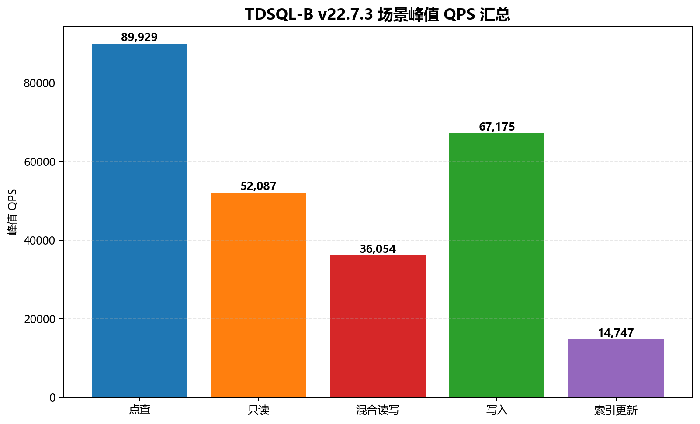
*TDSQL-B v22.7.3 场景峰值汇总*

> **[L1]** TDSQL-B v22.7.3 在 sysbench 5 个 OLTP 场景下完成测试，覆盖并发档 [32, 64, 128, 256, 512, 1000]。峰值 QPS 最高出现在 点查（89,929 @ 512 并发），最低出现在 索引更新（14,747 @ 512 并发）。

## 第 2 章 测试环境

### 2.1 数据库配置

| 项 | 值 |
| --- | --- |
| 产品 | TDSQL-B v22.7.3 |
| DB 端点 | - |
| 数据集 | tables=16, table_size=1000000 |
| 单测时长 | 300s |

### 2.2 测试方法

| 项 | 值 |
| --- | --- |
| 测试工具 | sysbench |
| 测试场景 | 点查、只读、写入、混合读写、索引更新 |
| 并发档 | [32, 64, 128, 256, 512, 1000] |

### 2.3 数据质量

| 检查项 | 结果 |
| --- | --- |
| 总记录数 | 90 条 |
| TPS / QPS / P95 有效率 | 100% |
| 数据来源 | test-resource/mock_records_aggregation.json |

## 第 3 章 全量测试数据

| 场景 | 并发 | TPS | QPS | P95 (ms) | P99 (ms) |
| --- | --- | --- | --- | --- | --- |
| 点查 | 32 | 19,494.95 | 19,494.95 | 1.14 | 1.64 |
| 点查 | 32 | 16,074.87 | 16,074.87 | 1.16 | 1.64 |
| 点查 | 32 | 17,343.76 | 17,343.76 | 1.16 | 1.60 |
| 点查 | 64 | 34,925.66 | 34,925.66 | 1.39 | 2.00 |
| 点查 | 64 | 28,323.44 | 28,323.44 | 1.39 | 1.92 |
| 点查 | 64 | 30,700.18 | 30,700.18 | 1.42 | 2.01 |
| 点查 | 128 | 63,461.25 | 63,461.25 | 2.52 | 3.58 |
| 点查 | 128 | 51,088.25 | 51,088.25 | 2.54 | 3.59 |
| 点查 | 128 | 56,880.38 | 56,880.38 | 2.59 | 3.65 |
| 点查 | 256 | 82,178.62 | 82,178.62 | 4.25 | 6.10 |
| 点查 | 256 | 66,856.78 | 66,856.78 | 4.26 | 5.85 |
| 点查 | 256 | 73,250.45 | 73,250.45 | 4.26 | 5.89 |
| 点查 | 512 | 89,928.71 | 89,928.71 | 7.95 | 11.41 |
| 点查 | 512 | 71,646.19 | 71,646.19 | 7.99 | 11.33 |
| 点查 | 512 | 79,641.75 | 79,641.75 | 7.84 | 11.24 |
| 点查 | 1000 | 84,599.90 | 84,599.90 | 15.62 | 21.71 |
| 点查 | 1000 | 67,337.58 | 67,337.58 | 15.89 | 22.27 |
| 点查 | 1000 | 74,860.15 | 74,860.15 | 15.86 | 22.39 |
| 只读 | 32 | 828.61 | 11,600.60 | 24.28 | 32.80 |
| 只读 | 32 | 651.85 | 9,125.96 | 24.03 | 32.93 |
| 只读 | 32 | 732.19 | 10,250.68 | 23.90 | 33.22 |
| 只读 | 64 | 1,458.11 | 20,413.59 | 29.61 | 42.40 |
| 只读 | 64 | 1,177.93 | 16,491.00 | 29.61 | 40.50 |
| 只读 | 64 | 1,315.13 | 18,411.79 | 29.05 | 40.85 |
| 只读 | 128 | 2,676.63 | 37,472.87 | 54.35 | 76.63 |
| 只读 | 128 | 2,099.20 | 29,388.81 | 54.17 | 73.19 |
| 只读 | 128 | 2,368.33 | 33,156.64 | 53.36 | 74.61 |
| 只读 | 256 | 3,515.52 | 49,217.26 | 88.54 | 123.43 |
| 只读 | 256 | 2,761.20 | 38,656.85 | 86.59 | 122.84 |
| 只读 | 256 | 3,104.37 | 43,461.17 | 86.63 | 120.77 |
| 只读 | 512 | 3,720.49 | 52,086.84 | 163.74 | 236.25 |
| 只读 | 512 | 2,940.55 | 41,167.67 | 166.22 | 227.19 |
| 只读 | 512 | 3,312.35 | 46,372.94 | 164.39 | 236.92 |
| 只读 | 1000 | 3,510.42 | 49,145.88 | 330.30 | 460.76 |
| 只读 | 1000 | 2,804.41 | 39,261.75 | 332.48 | 463.32 |
| 只读 | 1000 | 3,114.31 | 43,600.36 | 334.03 | 477.14 |
| 写入 | 32 | 4,873.50 | 14,620.51 | 5.34 | 7.70 |
| 写入 | 32 | 3,865.91 | 11,597.72 | 5.23 | 7.52 |
| 写入 | 32 | 4,391.70 | 13,175.11 | 5.29 | 7.39 |
| 写入 | 64 | 8,617.85 | 25,853.55 | 6.46 | 9.31 |
| 写入 | 64 | 6,942.02 | 20,826.05 | 6.39 | 8.98 |
| 写入 | 64 | 7,827.30 | 23,481.89 | 6.54 | 9.37 |
| 写入 | 128 | 15,818.31 | 47,454.94 | 11.78 | 16.72 |
| 写入 | 128 | 12,480.43 | 37,441.30 | 11.60 | 16.12 |
| 写入 | 128 | 14,272.38 | 42,817.14 | 11.67 | 16.25 |
| 写入 | 256 | 20,790.68 | 62,372.04 | 19.54 | 28.18 |
| 写入 | 256 | 16,295.91 | 48,887.74 | 19.12 | 26.79 |
| 写入 | 256 | 18,632.36 | 55,897.09 | 19.50 | 28.27 |
| 写入 | 512 | 22,391.81 | 67,175.43 | 36.92 | 51.88 |
| 写入 | 512 | 17,417.06 | 52,251.17 | 36.16 | 51.07 |
| 写入 | 512 | 20,142.74 | 60,428.22 | 36.55 | 51.93 |
| 写入 | 1000 | 20,713.72 | 62,141.15 | 73.08 | 102.59 |
| 写入 | 1000 | 16,471.39 | 49,414.16 | 73.64 | 100.31 |
| 写入 | 1000 | 18,810.26 | 56,430.79 | 72.95 | 100.08 |
| 混合读写 | 32 | 398.73 | 7,974.60 | 52.26 | 74.48 |
| 混合读写 | 32 | 331.28 | 6,625.69 | 53.05 | 72.02 |
| 混合读写 | 32 | 362.48 | 7,249.67 | 51.57 | 72.99 |
| 混合读写 | 64 | 717.34 | 14,346.84 | 64.15 | 92.98 |
| 混合读写 | 64 | 588.92 | 11,778.34 | 63.01 | 85.92 |
| 混合读写 | 64 | 647.62 | 12,952.36 | 63.82 | 88.14 |
| 混合读写 | 128 | 1,291.52 | 25,830.30 | 114.76 | 155.59 |
| 混合读写 | 128 | 1,087.87 | 21,757.36 | 116.14 | 164.18 |
| 混合读写 | 128 | 1,181.64 | 23,632.87 | 115.64 | 163.14 |
| 混合读写 | 256 | 1,684.73 | 33,694.61 | 187.47 | 260.10 |
| 混合读写 | 256 | 1,387.86 | 27,757.19 | 188.54 | 262.82 |
| 混合读写 | 256 | 1,543.89 | 30,877.75 | 188.86 | 262.39 |
| 混合读写 | 512 | 1,802.69 | 36,053.83 | 364.41 | 523.22 |
| 混合读写 | 512 | 1,501.03 | 30,020.65 | 363.68 | 525.48 |
| 混合读写 | 512 | 1,665.76 | 33,315.16 | 359.37 | 501.07 |
| 混合读写 | 1000 | 1,690.58 | 33,811.66 | 732.19 | 999.62 |
| 混合读写 | 1000 | 1,424.25 | 28,484.97 | 731.16 | 1,057.62 |
| 混合读写 | 1000 | 1,560.91 | 31,218.13 | 731.99 | 1,031.50 |
| 索引更新 | 32 | 3,273.38 | 3,273.38 | 7.25 | 10.05 |
| 索引更新 | 32 | 2,652.17 | 2,652.17 | 7.29 | 10.11 |
| 索引更新 | 32 | 2,890.43 | 2,890.43 | 7.29 | 10.43 |
| 索引更新 | 64 | 5,830.92 | 5,830.92 | 8.94 | 12.70 |
| 索引更新 | 64 | 4,731.63 | 4,731.63 | 9.00 | 12.90 |
| 索引更新 | 64 | 5,214.30 | 5,214.30 | 9.18 | 13.26 |
| 索引更新 | 128 | 10,598.84 | 10,598.84 | 16.25 | 22.76 |
| 索引更新 | 128 | 8,501.76 | 8,501.76 | 16.09 | 21.76 |
| 索引更新 | 128 | 9,508.19 | 9,508.19 | 16.48 | 23.53 |
| 索引更新 | 256 | 13,567.85 | 13,567.85 | 27.60 | 37.76 |
| 索引更新 | 256 | 11,060.74 | 11,060.74 | 26.82 | 37.02 |
| 索引更新 | 256 | 12,244.84 | 12,244.84 | 27.14 | 36.94 |
| 索引更新 | 512 | 14,746.99 | 14,746.99 | 50.85 | 71.63 |
| 索引更新 | 512 | 12,009.86 | 12,009.86 | 50.95 | 72.89 |
| 索引更新 | 512 | 13,057.94 | 13,057.94 | 51.43 | 70.27 |
| 索引更新 | 1000 | 13,965.57 | 13,965.57 | 100.99 | 137.41 |
| 索引更新 | 1000 | 11,356.38 | 11,356.38 | 103.42 | 148.48 |
| 索引更新 | 1000 | 12,325.56 | 12,325.56 | 100.69 | 140.96 |

## 第 4 章 性能分析

### 4.1.1 点查并发扩展

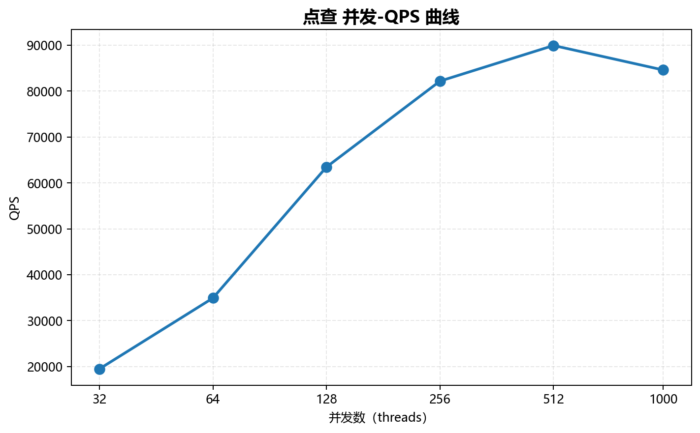
*点查 并发-QPS 曲线*

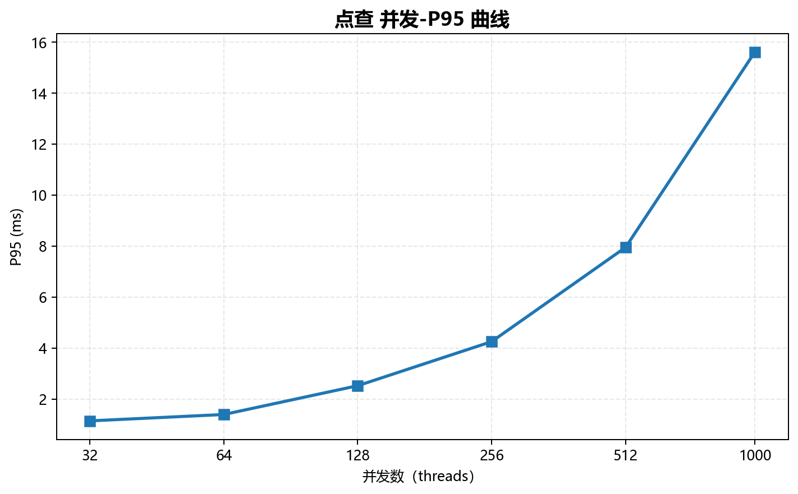
*点查 并发-P95 曲线*

### 4.1.2 只读并发扩展

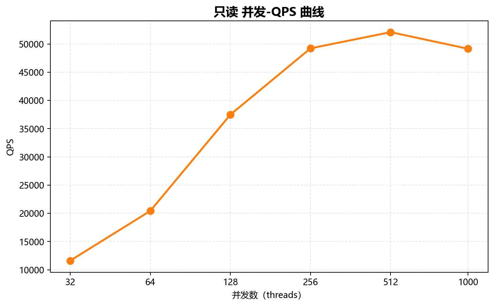
*只读 并发-QPS 曲线*

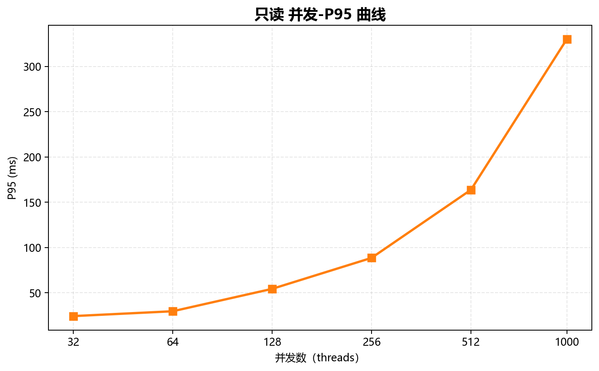
*只读 并发-P95 曲线*

### 4.1.3 写入并发扩展

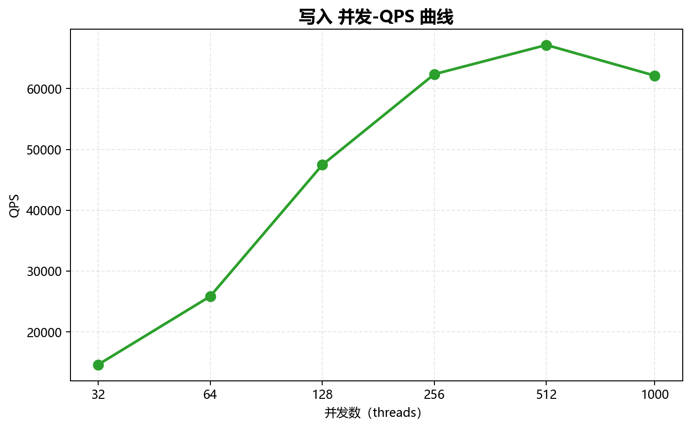
*写入 并发-QPS 曲线*

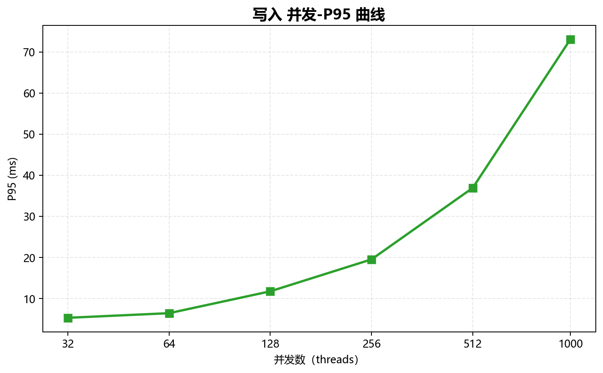
*写入 并发-P95 曲线*

### 4.1.4 混合读写并发扩展

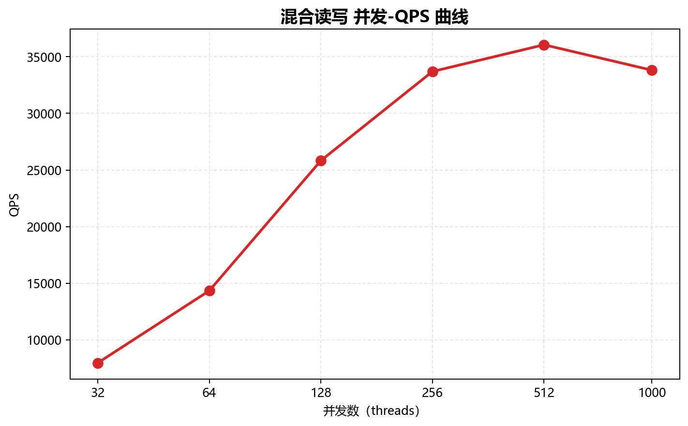
*混合读写 并发-QPS 曲线*

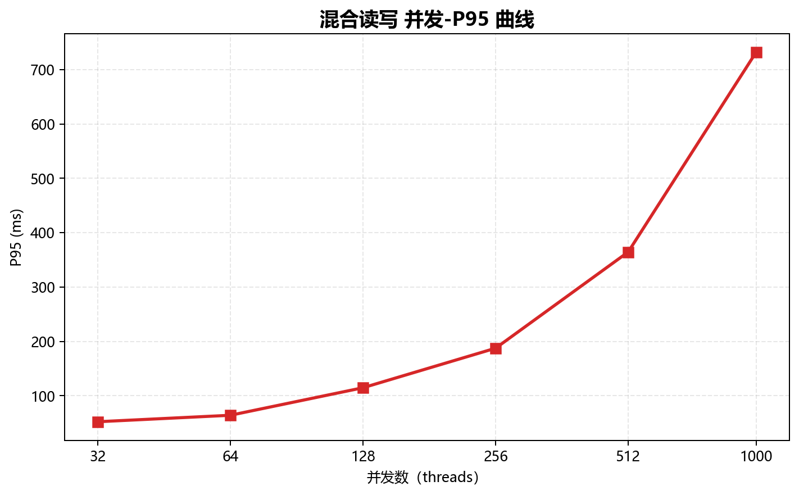
*混合读写 并发-P95 曲线*

### 4.1.5 索引更新并发扩展

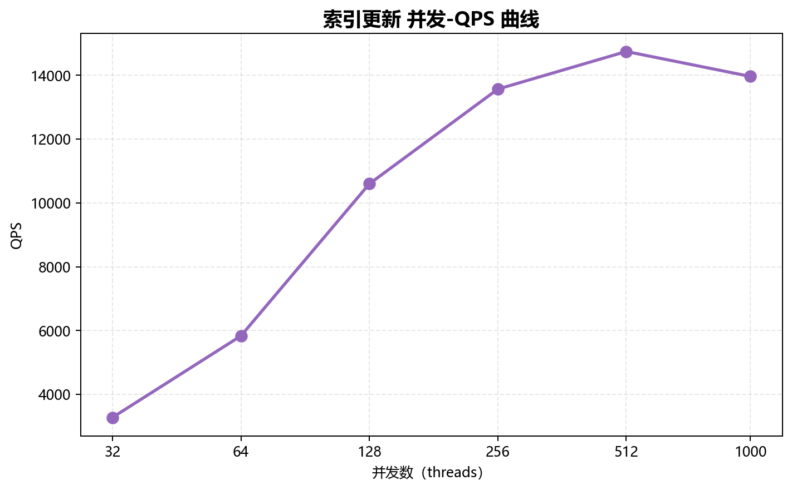
*索引更新 并发-QPS 曲线*

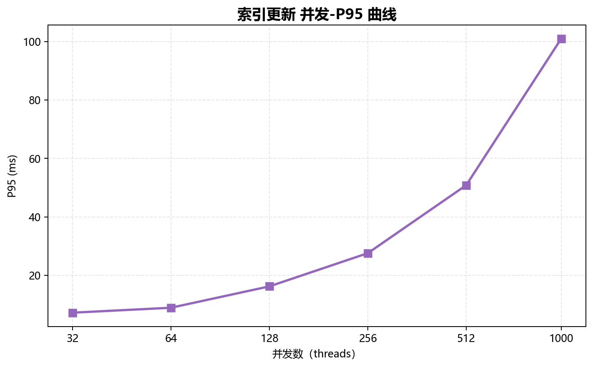
*索引更新 并发-P95 曲线*

## 第 5 章 优化建议

### 5.1 调优最佳实践

- 峰值 QPS 出现在 点查 @ 512 并发，建议生产连接池上限 768。
- Buffer Pool 建议设为内存的 70%~75%。
- 回归测试保持 sysbench 参数 `--db-ps-mode=auto --skip_trx=off --rand-type=uniform`。

### 5.2 测试边界

- 仅覆盖 sysbench 5 个 OLTP 场景。
- 未覆盖 OLAP / 复杂 JOIN / 大字段场景。
- 单数据集，未测试更大规模数据下的衰减。
